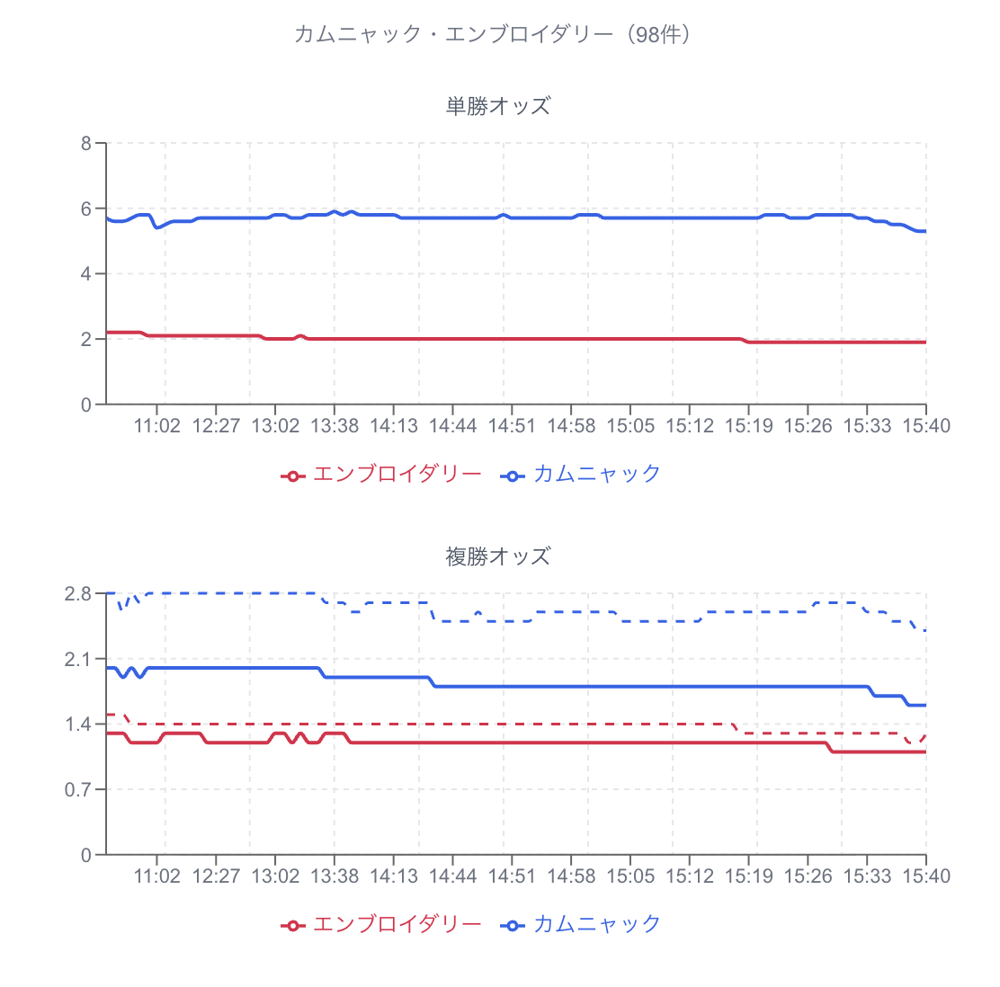
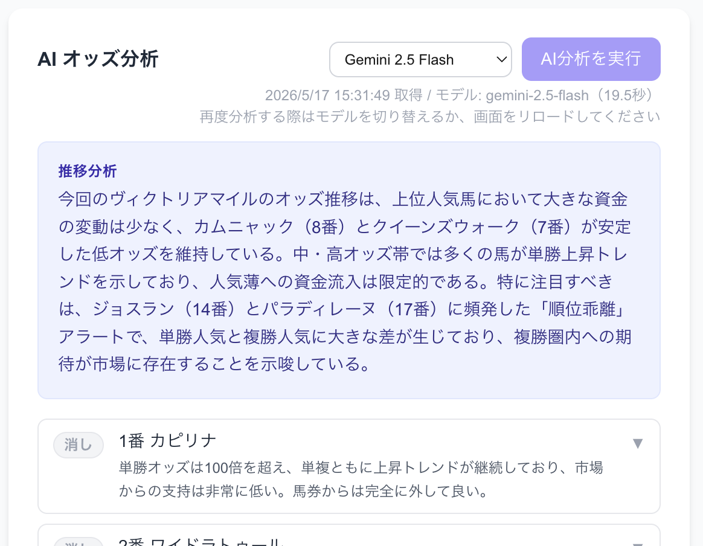
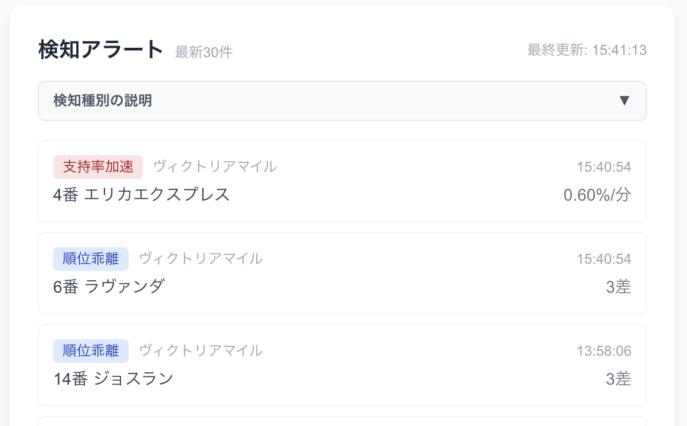

# Odds Alchemist

JRA（日本中央競馬会）のオッズ情報を定期的に取得・分析し、投資妙味のある異常オッズをリアルタイムで検知・通知するシステム。

> **免責事項**: 本システムは個人的な学習・研究目的で開発したものです。不特定多数での利用は想定していません。対象サービスの利用規約を遵守し、自己責任でご利用ください。

---

## 機能概要

- **スケジュール監視**: 発走時刻に応じてポーリング間隔を自動調整（30分 / 5分 / 1分）しながらオッズを継続取得
- **異常検知**: 6種類の異常を自動検知（上位3番人気は除外）
  - 支持率急増 / 順位乖離 / トレンド逸脱 / 支持率加速 / フェーズ逸脱 / オッズ断層
- **Slack 通知**: 異常検知時に Slack へアラートを送信（日次ユニーク）
- **オッズ推移グラフ**: URLと馬名を選択して単勝・複勝オッズの時系列グラフを表示
- **AI オッズ分析**: Gemini API によるオッズ推移の多角的分析と買い目推奨
- **永続化**: 取得データ・アラート・監視URLを Google Sheets に記録（再起動後も自動復元）

---

## 機能の詳細

### オッズ推移グラフ
レースURLと馬名を選択すると、単勝・複勝オッズの時系列グラフを表示する。
馬ごとに色分けされ、発走までの資金の流れを視覚的に把握できる。



### AI オッズ分析
Gemini API を使用し、オッズ推移の軌跡・モメンタム・馬間の資金移動を多角的に分析。
使用するモデルは分析前に選択可能。
各馬に「軸候補 / 相手候補 / 対象外」の verdict と根拠コメントを付与し、
単勝・馬単・三連単（荒れレース時）の推奨買い目を自動生成する。



### 検知アラート
異常なオッズ変動をリアルタイムで検知し、種別タグ・馬名・検知時刻とともに一覧表示する。
10秒ごとに自動更新。検知時は Slack にも通知される。



---

## セットアップ・起動

初回セットアップ（GCP キー取得・`.env` 設定・Docker 起動・LAN アクセス設定など）は **[docs/setup_guide.md](docs/setup_guide.md)** を参照してください。

---

## フロントエンド構成

本システムのフロントエンドは用途別に2つに分かれている。

| FE | ディレクトリ | 起動環境 | 機能 |
|---|---|---|---|
| 管理用 FE | `frontend/` | 自宅 Docker Compose | URL登録・削除、データ管理（シートクリア） |
| 閲覧用 FE | `frontend-viewer/` | Vercel（外部公開） | オッズ推移グラフ、検知アラート、AI分析 |

閲覧用 FE は Google OAuth（NextAuth v5）で認証し、Google Sheets を直接読み取る（バックエンド不要）。

---

## 使い方

### 管理操作（自宅ローカルから）

1. **監視URL を登録する**: 管理用 FE の「スケジュール監視対象URL」フォームに Yahoo!スポナビ競馬のオッズページURLを入力して登録する
   - 例: `https://sports.yahoo.co.jp/keiba/race/odds/tfw/2606020211`
   - 登録直後に初回オッズ取得・異常検知が即時（非同期）で実行される
2. **自動監視**: 以降はスケジューラーが発走時刻に応じた間隔で自動取得・異常検知を継続する
3. **Slack 通知**: 設定済みの場合、異常検知時に Slack へ通知が届く

### 閲覧（外出先からも可）

4. **アラートを確認する**: 閲覧用 FE（Vercel）にアクセスし、右カラムのアラート一覧でリアルタイム確認する（10秒ごとに自動更新）
5. **オッズ推移グラフを表示する**: 閲覧用 FE の左カラムでURLと馬名を選択してグラフを描画する

---

## Google Sheets の構成

| シート名 | 用途 | 列 |
|---|---|---|
| `OddsData` | 取得したオッズデータ | A:取得日時 / B:URL / C:レース名 / D:馬番 / E:馬名 / F:単勝 / G:複勝下限 / H:複勝上限 |
| `Alerts` | 検知アラート | A:検知日時 / B:URL / C:レース名 / D:馬番 / E:馬名 / F:検知タイプ / G:数値 |
| `Targets` | 監視URL（再起動時復元用） | A:URL / B:最終実行時間 / C:次回実行予定時間 |
| `Results` | レース着順（戦略検証用） | A:記録日時 / B:URL / C:レース名 / D:1着馬番 / E:2着馬番 / F:3着馬番 / G:メモ |

---

## API エンドポイント

バックエンド（Spring Boot）が提供する REST API。

| メソッド | パス | 説明 |
|---|---|---|
| `GET` | `/api/odds/targets` | 登録済み監視URL一覧を取得 |
| `POST` | `/api/odds/targets` | 監視URLを追加 |
| `DELETE` | `/api/odds/targets` | 監視URLを削除 |
| `DELETE` | `/api/odds/sheets` | シートデータをクリア（`?sheet=OddsData\|Alerts`） |

---

## AI分析仕様

閲覧用 FE の AI 分析機能（Gemini API）がオッズ推移データを活用する仕様。

> **注**: 以下は Step 37 以降で実装された新戦略（初期仮説、未検証）に基づく仕様。

### AIに渡すデータ構造

各馬の最新20件の時系列テーブルと、出馬表情報（Step 38 以降）を渡す。

**オッズ時系列（各馬ごと）:**

| 列 | 内容 |
|---|---|
| 時刻 | HH:MM形式 |
| 単勝 | 現在の単勝オッズ |
| 複勝下限 / 複勝上限 | 複勝オッズの範囲 |
| 単勝変化率 | 初回取得値からの累積変化率（%） |
| 単勝前回比 | 1スキャン前との単勝オッズの差分 |
| 複勝前回比 | 1スキャン前との複勝下限の差分 |
| 層タグ | `[直前]` または `[参考]`（信頼度ウィンドウ） |

加えて集計行として「単勝トレンド分類・直近5件の単勝合計変化・直近5件の複勝合計変化」を付与する。

**信頼度ウィンドウ（層タグ）:**

| タグ | 対象区間 | 役割 |
|---|---|---|
| `[直前]` | 発走1時間以内（5分/1分ポーリング区間） | 判断の主材料 |
| `[参考]` | 発走1時間以上前（30分ポーリング区間） | トレンド変化量計算の基準点 |

**出馬表情報（Step 38 以降）:**

| 項目 | 内容 |
|---|---|
| 騎手名 | |
| 前走レース名・着順 | |
| 馬体重・増減（kg） | |
| 今走距離の着別度数 | 例: `芝1600m: 1-3-0-2` |

### 予想戦略（初期仮説）

**軸（単勝・馬単の1着候補）:** ロジックFの断層検知で定義した中穴ゾーンの馬（高人気でも大穴でもない帯）

**相手（馬単・三連単で絡める候補）:** オッズ推移のトレンドシグナルが出ている馬

| 役割 | verdict | 選定基準 | 上限 |
|---|---|---|---|
| 単勝・馬単の軸 | 軸候補 | ロジックFの断層直上付近（中穴ゾーン） | 最大2頭 |
| 馬単・三連単の相手 | 相手候補 | C・D シグナル主軸、A・E で補強 | 最大4頭 |
| 除外 | 対象外 | 根拠なし・断層外かつトレンドなし | 制限なし |

### アラートの役割分担

| グループ | 該当ロジック | 役割 |
|---|---|---|
| 相手候補 主要シグナル | C（トレンド逸脱）・D（支持率加速） | `相手候補` に引き上げる主要根拠 |
| 相手候補 補強シグナル | A（支持率急増）・E（フェーズ逸脱） | 確度を高める二段目の根拠 |
| 荒れレース判定専用 | B（順位乖離）・F（断層変化） | 個別馬の verdict には使わず `is_chaotic_race` 判定に使用 |

### 買い目の生成

| 券種 | 条件 | 内容 |
|---|---|---|
| 単勝 | 常時 | 軸候補の馬全員 |
| 馬単 | 常時 | 軸候補1着 × 相手候補2着 の全組み合わせ |
| 三連単 | 荒れレース判定時のみ | 軸候補1着 → 相手候補2・3着の流し |

---

## 技術スタック

| レイヤー | 技術 |
|---|---|
| バックエンド | Java 21, Spring Boot 4.0.x |
| 管理用 FE (`frontend/`) | Next.js 16 (App Router), TypeScript, Tailwind CSS |
| 閲覧用 FE (`frontend-viewer/`) | Next.js 16 (App Router), TypeScript, Tailwind CSS, Recharts, NextAuth v5, googleapis |
| HTML解析 | Jsoup |
| 永続化 | Google Sheets API |
| インフラ | Docker Compose（管理用）, Vercel（閲覧用） |

---

## 開発

```bash
# バックエンドテスト
cd backend && ./gradlew test

# 管理用 FE ビルド確認
cd frontend && npm run build

# 閲覧用 FE ビルド確認
cd frontend-viewer && npm run build
```
